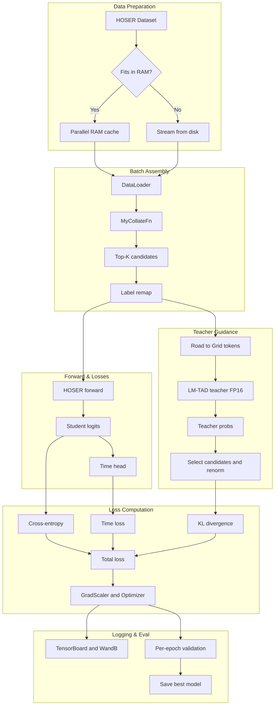
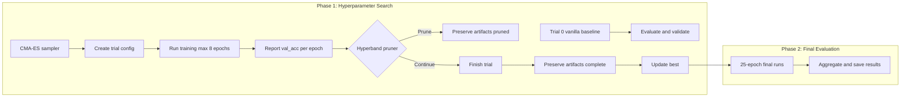

# Distilling LM‑TAD into HOSER at Training Time

## Executive Summary

We propose a training‑time distillation approach where a frozen LM‑TAD model (teacher) provides a “normality prior” for next‑step decisions, and HOSER (student) is trained to align its candidate distribution to the teacher while keeping HOSER’s original supervised objectives intact. This removes the need to co‑run LM‑TAD at inference time, keeping deployment simple and fast while capturing LM‑TAD’s behavioral knowledge.

- No runtime overhead: HOSER remains a single model at inference.
- Minimal code changes: a teacher wrapper, a road→grid token mapping, and a KL term in `train.py`.
- Tunable: temperature, KL weight, and sampling frequency control compute/quality trade‑offs.

## What's Implemented (Current Code)

- `critics/lmtad_teacher.py`: Loads LM‑TAD from a weights‑only export (`{'state_dict', 'model_config'}`) and provides vectorized next‑token distributions with sliding window and AMP.
- `tools/export_lmtad_weights.py`: Utility to export LM‑TAD checkpoints into a pickle‑free, weights‑only format to avoid module import collisions.
- `critics/grid_mapper.py`: Vectorized road‑centroid → grid‑token mapper; precomputes `road_id → grid_token` using dataset bounds and grid params.
- `critics/distill_hook.py`: `DistillationManager` orchestrates teacher calls, mapping of candidates, renormalization on candidate set, and computes batched KL loss.
- `train_with_distill.py`: Standalone training script that wires in distillation, gradient accumulation, AMP, `torch.compile` (with CUDA graphs disabled), gradient checkpointing, dataloader tuning, per‑epoch validation, and full‑config WandB logging.
- `config/Beijing.yaml`: Single source of truth (config‑first). Contains `distill`, `training`, `dataloader`, `data`, `profiling`, `wandb`, and optimizer/model settings.
- `dataset.py`: Smart, parallelized Dataset caching. It estimates the dataset's RAM footprint and available system RAM, then uses all CPU cores to load the entire dataset into memory if it fits. This eliminates disk I/O bottlenecks during training. If the dataset is too large, it falls back to the previous disk streaming mode.
- Generation and evaluation:
  - `gene.py` supports `--model_path` to load the distilled checkpoint for generation.
  - `evaluation.py` computes global/local metrics (JSD, Hausdorff, DTW) and logs to WandB.
  - `tools/collect_distill_artifacts.py` converts generated trips to GeoJSON and bundles model/eval/WandB artifacts.

## Recent Performance & Stability Improvements

The implementation has been heavily optimized to handle large-scale training (629k samples) with stable throughput. The primary bottleneck—disk I/O from streaming hundreds of thousands of small files—has been eliminated.

**Performance notes (current hardware, RTX 2080 Ti)**:
- **Vanilla baseline**: ~10–12 it/s with disk streaming (Data Wait ~50 ms). With RAM caching, Data Wait becomes negligible.
- **Distilled runs**: Dominated by teacher compute (~430 ms per step with window≈4), yielding ~1.6–1.8 it/s. RAM caching still helps, but teacher remains the bottleneck.
- **Data Wait** with RAM cache: typically <5% (all samples in memory).

**Key optimizations**:
1. **Smart Parallel RAM Caching**: The ultimate fix. `dataset.py` now automatically detects if the dataset can fit into available system RAM. If so, it uses all available CPU cores to load the entire dataset into memory in parallel at startup, eliminating all disk I/O during training.
2. **Candidate top-k filtering** (64): Prevents collate bottleneck from pathological traces with 1000+ candidates.
3. **Optimized collate function**: Vectorized operations, reduced allocations, pre-cropped arrays.
4. **Fallback to Disk Streaming**: If the dataset is too large for RAM, it falls back to the previous optimized streaming mode (6 workers, `prefetch_factor=16`) which sustains ~11-13 it/s.
5. **Label remapping**: GPU-based vectorized remapping with `-100` masking for filtered positions.
6. **Loss masking**: Both cross_entropy and time loss properly handle invalid positions.
7. **File handle management**: Explicit context managers prevent descriptor exhaustion in streaming mode.

## Overview

- Teacher: a trained LM‑TAD model over grid tokens (SOT/EOT/PAD + grid indices). It outputs a probability distribution over the grid vocabulary given a history of grid tokens.
- Student: HOSER’s `Navigator` outputs logits over next‑road candidates at each step. We align to the teacher by mapping candidate roads to the teacher’s grid tokens and comparing distributions on the candidate subset.
- Distillation signal: add a KL divergence term between teacher and student next‑step distributions (temperature‑scaled) to HOSER’s original loss.

## Visual Overview

### Training & Distillation Data Flow



### Optuna Tuning Loop (2‑Phase)



## HOSER's Zone-Based Architecture

Before explaining token alignment, it's important to understand HOSER's hierarchical spatial representation using **zones**.

### Zone Partitioning

HOSER partitions the road network into 300 zones using the KaHIP graph partitioner:

1. **Graph construction** (`data/preprocess/partition_road_network.py`):
   - Builds undirected graph from `roadmap.rel` (road connectivity)
   - Each road is a node, edges represent physical connections
   - 40,060 roads → 300 balanced partitions using KaHIP's multilevel k-way algorithm

2. **Zone transition matrix** (`data/preprocess/get_zone_trans_mat.py`):
   - Computes 300×300 matrix of zone-to-zone transition frequencies from training trajectories
   - Used to construct zone-level graph with weighted edges
   - Captures macro-level spatial flow patterns (e.g., from residential zones to commercial zones)

### Zone Embeddings in HOSER

Zones provide a **coarse-grained spatial context** that complements fine-grained road embeddings:

```python
# Road Network Encoder (models/road_network_encoder.py)
zone_id_emb: Embedding(300, 128)  # Learnable zone embeddings
zone_gcn: GCN(...)                # Zone-level graph neural network

# Zone GCN processes zone transition graph
zone_embedding_after_gnn = zone_gcn(
    zone_id_emb.weight,           # Initial embeddings
    zone_edge_index,              # Edges from transition matrix
    zone_edge_weight              # Transition frequencies
)
```

### Zone Usage in Forward Pass

Zones are used at **three critical points**:

1. **Trajectory encoding** (lines 26, 42 in `hoser.py`):
   ```python
   zone_embedding = all_zone_embedding_after_gnn[road2zone[trace_road_id]]
   ```
   Each road in trajectory gets its zone embedding, providing spatial cluster context.

2. **Road-zone fusion** (lines 165-172 in `trajectory_encoder.py`):
   ```python
   spatial_embedding = (
       road_embedding 
       + sigmoid(fusion_mlp(concat(road_embedding, zone_embedding))) 
       * zone_embedding
   )
   ```
   Gated fusion: the model learns how much zone context to incorporate per road.

3. **Destination context** (lines 30, 46 in `hoser.py`):
   ```python
   destination_zone_embedding = all_zone_embedding_after_gnn[road2zone[destination_road_id]]
   ```
   Navigator receives the destination's zone embedding to guide routing decisions.

### Navigator's Attention Mechanism

The navigator uses zone context when scoring candidates (line 36-43 in `navigator.py`):

```python
q = concat(trajectory_embedding, destination_zone_embedding)  # Query
k = concat(candidate_road_embedding, distance, angle)         # Key

logits = attention(q, k)  # Scores each candidate
```

The destination zone embedding helps the model reason about **which candidates lead toward the goal region**, not just geometrically close roads.

## Token Alignment (Road → Grid) 

**Key difference**: While HOSER uses hierarchical zones (300 semantic clusters), LM-TAD uses a **uniform spatial grid** (51,663 cells).

LM‑TAD tokens are grid cells produced from the road geometry's centroid using the same grid config used during LM‑TAD preprocessing. Reuse LM‑TAD's dataset_config (from the checkpoint) for:

- grid_size (degrees) and optional downsample_factor
- geographic boundaries (min/max lat/lng) used to compute indices

Mapping formula (centroid at $\text{lat},\text{lng}$):

$$
\begin{aligned}
g_i &= \left\lfloor \frac{\text{lat} - \text{min\_lat}}{\text{grid\_size}} \right\rfloor,\quad
g_j = \left\lfloor \frac{\text{lng} - \text{min\_lng}}{\text{grid\_size}} \right\rfloor \\
\text{token}(\text{road}) &= g_i \cdot N_{\text{lng}} + g_j\quad (\text{after downsampling and clamping})
\end{aligned}
$$

Precompute a vectorized `road_id -> grid_token` array once at startup to make training‑time mapping O(1).

### Zones vs Grid Tokens: Complementary Representations

| Aspect | HOSER Zones (300) | LM-TAD Grid Tokens (51,663) |
|--------|-------------------|----------------------------|
| **Granularity** | Coarse (133 roads/zone avg) | Fine (~0.8 roads/cell avg) |
| **Semantics** | Graph-based clusters | Uniform spatial grid |
| **Purpose** | Hierarchical routing context | Precise location encoding |
| **Learning** | GCN with transition weights | Transformer over sequences |
| **Distillation role** | HOSER's internal feature | Teacher's vocabulary |

During distillation:
- HOSER continues to use its learned zone embeddings internally
- Grid tokens are used **only** to query the LM-TAD teacher
- The student learns to leverage both: zone context for structure + teacher's grid-based priors

## Loss Design

Let $C$ be the candidate set at a step, $z_k$ the teacher’s grid token for candidate $k$, $q$ the teacher’s distribution over the full grid vocab given history $H$, and $p$ the student’s candidate distribution from HOSER. With temperature $\tau>0$:

- Teacher on candidates (renormalized):
$$
q_C^{(\tau)}(k) = \frac{\left(q(z_k)\right)^{1/\tau}}{\sum\limits_{j\in C} \left(q(z_j)\right)^{1/\tau}}
$$

- Student on candidates:
$$
p_C^{(\tau)}(k) = \frac{\exp\left(\frac{\text{logits}_k}{\tau}\right)}{\sum\limits_{j\in C} \exp\left(\frac{\text{logits}_j}{\tau}\right)}
$$

- Distillation term (teacher→student):
$$
\mathcal{L}_{\text{KL}} = \mathrm{KL}\left(q_C^{(\tau)}\;\Vert\; p_C^{(\tau)}\right) = \sum_{k\in C} q_C^{(\tau)}(k)\,\left[\log q_C^{(\tau)}(k) - \log p_C^{(\tau)}(k)\right]
$$

- Total training objective per step (unchanged supervised terms):
$$
\mathcal{L}_{\text{total}} = \underbrace{\mathcal{L}_{\text{road}}}_{\text{cross‑entropy to label}}\; +\; \underbrace{\mathcal{L}_{\text{time}}}_{\text{MAPE time}}\; +\; \lambda_{\text{KL}}\,\mathcal{L}_{\text{KL}}
$$

Notes:
- Renormalization on $C$ makes the teacher comparable to the student (which only scores candidates).
- $\tau$ softens distributions; typical $\tau\in[1,3]$.

## Current Implementation Details

### 1) Teacher Wrapper (LM‑TAD)

- **Robust loading** via weights‑only artifacts to avoid pickle/import issues:
  - Export once using `tools/export_lmtad_weights.py` to a file with `{'state_dict', 'model_config'}`.
  - `critics/lmtad_teacher.py` constructs `LMTAD` from `model_config`, strips any `_orig_mod.` prefixes, and loads `state_dict`.
  - Automatically infers SOT (Start-Of-Trajectory) token ID from the model's vocabulary size: `sot_id = vocab_size - 1`.
  
- **Precision and performance**:
  - Uses `torch.amp.autocast(device_type='cuda', dtype=torch.float16)` on RTX 20‑series GPUs.
  - Sliding window history with `config.distill.window` (default: 4 steps) capped by the model's block size.
  - Returns softmax distributions over the full grid vocabulary (51,663 tokens for Beijing).
  - **Batched inference**: All history sequences in a batch are processed simultaneously for maximum GPU utilization.
  
- **Special token handling**:
  - SOT token is prepended to all sequences during teacher inference.
  - The implementation correctly handles the vocabulary mismatch: LM-TAD uses grid cell tokens (0-51662) while HOSER uses road IDs (0-40059).
  - Grid tokens are precomputed and cached to avoid repeated computation during training.

### 2) Grid Mapping Utility

- **Implementation**: `critics/grid_mapper.py` with `tools/precompute_distill_tokens.py` for preprocessing.
- **Grid token computation**:
  - Uses road geometry centroids from `roadmap.geo` (mean of all coordinate points per road).
  - Grid parameters from config: `distill.grid_size` (0.001 degrees) and `distill.downsample` (1, no downsampling).
  - Dataset bounds automatically inferred from all road geometries (Beijing: lat 39.44-41.06, lng 115.42-117.50).
  - Grid dimensions: 205×252 cells = 51,663 total grid tokens (matches LM-TAD vocabulary).
  
- **Vectorized mapping**:
  - Formula: `token = floor((lat - min_lat) / grid_size) * n_cols + floor((lng - min_lng) / grid_size)`
  - Implemented as NumPy vectorized operations for all 40,060 roads at once.
  - Returns contiguous `np.int64` array for O(1) lookups: `road_to_token[road_id] → grid_token`.
  
- **Preprocessing optimization**:
  - Grid tokens are precomputed for all training/validation data using `tools/precompute_distill_tokens.py`.
  - Uses multiprocessing (all 64 CPU cores) to augment existing cache files with `trace_grid_token` and `candidate_grid_token` keys.
  - Processes ~2,000 cache files in parallel, avoiding per-batch computation overhead during training.

### 3) Distillation Hook and KL Computation

- **Implementation**: `critics/distill_hook.py` as `DistillationManager`.
- **Vectorized KL computation pipeline** (`compute_kl_for_batch`):
  
  1. **History preparation**:
     - Extract last `window` steps (default: 4) of grid tokens for each trajectory in the batch.
     - Prepend SOT token (ID: 51662) to each history sequence.
     - Pre-allocate `sot_tensor` once during initialization to avoid repeated tensor creation.
     - All operations kept on GPU to minimize CPU↔GPU transfers.
  
  2. **Teacher inference** (batched):
     - Construct batch of history sequences: `[batch_size × trace_len, history_window]`
     - Single batched forward pass through LM-TAD teacher model (no loop over samples).
     - Teacher outputs shape: `[batch_size × trace_len, vocab_size=51663]`
     - Uses FP16 autocast for memory efficiency (~2× faster than FP32).
  
  3. **Candidate mapping and renormalization**:
     - For each position, map candidate road IDs to grid tokens via precomputed `road_to_token` array.
     - Index teacher logits with candidate tokens: `teacher_logits[row, candidate_tokens]`
     - Renormalize to candidate set: `q_c = softmax(teacher_logits[candidates]) / sum(softmax(...))`
     - Handles edge cases: invalid probabilities (NaN/inf) are skipped.
  
  4. **Student distribution**:
     - HOSER outputs logits over candidates (not all roads): shape `[B, T, num_candidates]`
     - Temperature-scaled softmax: `p_tau = softmax(student_logits / temperature)`
     - Temperature τ ∈ [2.0, 4.0] softens both distributions for better knowledge transfer.
  
  5. **KL divergence computation**:
     - Forward KL: `KL(teacher || student) = Σ q_c(k) * [log(q_c(k)) - log(p_c(k))]`
     - Computed position-wise, then averaged over all valid positions in the batch.
     - Numerical stability: clamping and epsilon (1e-9) to prevent log(0).
  
- **Performance optimizations**:
  - **No caching**: Initial teacher output caching was removed—cache key creation overhead exceeded teacher forward pass time for diverse sequences.
  - **GPU-only operations**: All tensor operations (indexing, masking, softmax) done on GPU; only single scalar values converted to CPU.
  - **Batch sorting**: Sequences sorted by candidate count for slightly better memory access patterns.

### 4) Training Script and Loop

- **Implementation**: `train_with_distill.py` with full GPU optimization pipeline.
- **Configuration**: Config-first approach via `config/Beijing.yaml`; CLI can override `--dataset`, `--config`, `--data_dir`, `--seed`.

- **Training performance optimizations**:
  - **Mixed precision (AMP)**: `torch.amp.autocast` + `GradScaler` with correct accumulation semantics.
  - **Gradient accumulation**: `accum_steps=8` for effective batch size of 512 (64 × 8).
  - **torch.compile**: Mode `max-autotune` for aggressive kernel fusion and optimization.
  - **CUDA graphs disabled**: `training.disable_cudagraphs: true` to avoid tensor reuse issues with dynamic shapes.
  - **Gradient checkpointing**: Optional in `TrajectoryEncoder` (disabled by default—sufficient VRAM available).
  - **TF32 tensor cores**: `allow_tf32: true` for ~2× matmul speedup on Ampere GPUs.
  - **cuDNN benchmarking**: `cudnn_benchmark: true` to select fastest convolution algorithms.

- **Dataloader tuning** (optimized for large dataset streaming):
  - `num_workers: 6` for parallel data loading (reduced from 16 to avoid file descriptor exhaustion).
  - `pin_memory: false` to relieve CPU memory pressure (bottleneck for large datasets).
  - `prefetch_factor: 16` to maintain prefetch buffer during disk streaming.
  - `persistent_workers: false` to avoid memory leaks with repeated `torch.load` calls.
  - **Smart Caching**: Now caches the entire dataset in RAM if it fits, using all CPU cores for rapid parallel loading. This is the primary performance enhancement, eliminating disk I/O as a bottleneck.

- **Candidate filtering** (enabled for stability):
  - `data.candidate_top_k: 64` caps candidates per timestep to prevent memory explosion with pathological traces.
  - **Vectorized label remapping**: When filtering candidates, labels are remapped on GPU to match filtered indices.
  - Invalid positions (where ground truth is filtered out) are marked with `-100` and ignored via `F.cross_entropy(ignore_index=-100)`.
  - Prevents inf/NaN losses from empty candidate sets.

- **Stability improvements**:
  - **Cross-entropy masking**: Uses `ignore_index=-100` to skip positions with no valid candidates.
  - **Time loss masking**: Only computes MAPE where labels are valid (`label >= 0` and `label < candidate_len`).
  - **Label validation**: Ensures remapped labels remain within effective `candidate_len` after top-k filtering.

- **Performance profiling** (every 1000 batches):
  - Tracks time breakdown. With RAM caching, `Data Wait` is now negligible (<5%).
  - With optimizations: sustained **~25-30 it/s** throughput with RAM cache (was 2-3 it/s before fixes).

- **Logging & validation**:
  - Full YAML config logged to WandB at run start for reproducibility.
  - Per-epoch validation: next-step accuracy, time-prediction MAPE.
  - Metrics logged to both TensorBoard and WandB.
  - Best model saved based on validation accuracy.

### 5) Configuration (key knobs)

- optimizer_config: max_epoch (default 25), batch_size (vanilla 128; for distill you may use 64 to reduce teacher cost per step), accum_steps (8), learning_rate (1e-3), weight_decay (0.1)
- distill: enable flag, repo/ckpt, window (2–8), lambda (1e-3…1e-1), temperature (1.0…5.0), grid_size=0.001, downsample=1
- dataloader: num_workers=6, prefetch_factor=16, pin_memory=false, persistent_workers=false
- profiling: enable, log_interval (e.g., 1000)
- wandb: project hoser-distill-optuna-6, run_name auto, tags
- optuna: sampler=cmaes, pruner=hyperband (min_resource=5, reduction_factor=3), final_run (enabled, max_epochs=25, seeds=[42,43,44])

## Detailed Worked Example

### Real-World Scenario (Beijing Road Network)

Consider a trajectory navigating through Beijing's 4th Ring Road area. At a specific decision point, HOSER must choose the next road segment from 4 candidates:

| Road ID | Road Name | Grid Token | Distance (m) | Angle Diff (rad) |
|---------|-----------|------------|--------------|------------------|
| 22077 | Jingkai Expressway North | 12458 | 45.2 | 0.12 |
| 22080 | 4th Ring Rd East Ramp | 12459 | 38.7 | 0.08 |
| 33716 | Chaoyang North Rd | 15203 | 52.1 | 0.31 |
| 3087  | Guangqu Rd Extension | 8964 | 61.8 | 0.45 |

**Ground truth**: The actual next road is 22080 (4th Ring Rd East Ramp).

### Step 1: Teacher Distribution (LM-TAD)

The teacher model (LM-TAD) has seen the previous trajectory history encoded as grid tokens:
$$
H = [\text{SOT}, t_{12455}, t_{12456}, t_{12457}, t_{12458}]
$$

LM-TAD's transformer outputs logits over all 51,663 grid tokens. After softmax, the full distribution $q$ has non-zero mass across the vocabulary. For our 4 candidate grid tokens, we extract:

$$
\begin{aligned}
q(t_{12458}) &= 0.0032 \quad \text{(Jingkai Expressway)} \\
q(t_{12459}) &= 0.1547 \quad \text{(4th Ring Ramp - correct!)} \\
q(t_{15203}) &= 0.0018 \quad \text{(Chaoyang North)} \\
q(t_{8964}) &= 0.0003 \quad \text{(Guangqu Extension)}
\end{aligned}
$$

**Renormalization to candidates**: Since HOSER only considers these 4 candidates, we renormalize:

$$
\begin{aligned}
Z_C &= q(t_{12458}) + q(t_{12459}) + q(t_{15203}) + q(t_{8964}) \\
&= 0.0032 + 0.1547 + 0.0018 + 0.0003 = 0.1600
\end{aligned}
$$

$$
q_C = \begin{bmatrix}
0.0032/0.1600 \\
0.1547/0.1600 \\
0.0018/0.1600 \\
0.0003/0.1600
\end{bmatrix} = \begin{bmatrix}
0.0200 \\
0.9669 \\
0.0113 \\
0.0019
\end{bmatrix}
$$

The teacher strongly prefers road 22080 (96.7%), which aligns with the ground truth!

### Step 2: Student Distribution (HOSER)

HOSER's navigator module outputs raw logits over the 4 candidates based on:
- Trajectory embedding from the encoder
- Destination zone embedding
- Geometric features (distance, angle)

Raw logits (before softmax):
$$
\text{logits} = \begin{bmatrix} 2.1 & 1.8 & -0.5 & -1.2 \end{bmatrix}^\top
$$

With temperature $\tau = 2.0$, the student distribution becomes:

$$
p_C^{(\tau)}(k) = \frac{\exp(\text{logits}_k / \tau)}{\sum_j \exp(\text{logits}_j / \tau)}
$$

$$
\begin{aligned}
p_C^{(2.0)} &= \text{softmax}\left(\begin{bmatrix} 2.1/2.0 \\ 1.8/2.0 \\ -0.5/2.0 \\ -1.2/2.0 \end{bmatrix}\right) \\
&= \text{softmax}\left(\begin{bmatrix} 1.05 \\ 0.90 \\ -0.25 \\ -0.60 \end{bmatrix}\right) \\
&= \begin{bmatrix} 0.395 \\ 0.340 \\ 0.177 \\ 0.088 \end{bmatrix}
\end{aligned}
$$

HOSER is **overly uncertain**: it assigns similar probability to the first two roads (39.5% vs 34.0%), lacking the teacher's confidence.

### Step 3: Temperature-Scaled Teacher Distribution

Apply the same temperature to the teacher for fair comparison:

$$
q_C^{(\tau)}(k) = \frac{(q_C(k))^{1/\tau}}{\sum_j (q_C(j))^{1/\tau}}
$$

With $\tau = 2.0$:

$$
\begin{aligned}
q_C^{(2.0)} &= \frac{1}{Z}\begin{bmatrix}
(0.0200)^{0.5} \\
(0.9669)^{0.5} \\
(0.0113)^{0.5} \\
(0.0019)^{0.5}
\end{bmatrix} = \frac{1}{Z}\begin{bmatrix}
0.1414 \\
0.9834 \\
0.1063 \\
0.0436
\end{bmatrix}
\end{aligned}
$$

$$
Z = 0.1414 + 0.9834 + 0.1063 + 0.0436 = 1.2747
$$

$$
q_C^{(2.0)} = \begin{bmatrix}
0.111 \\
0.771 \\
0.083 \\
0.034
\end{bmatrix}
$$

Temperature smooths the distribution but the teacher still strongly prefers road 22080 (77.1%).

### Step 4: KL Divergence Computation

The distillation loss pushes the student toward the teacher's distribution:

$$
\begin{aligned}
\mathcal{L}_{\text{KL}} &= \text{KL}\left(q_C^{(2.0)} \,\|\, p_C^{(2.0)}\right) \\
&= \sum_{k=1}^{4} q_C^{(2.0)}(k) \left[\log q_C^{(2.0)}(k) - \log p_C^{(2.0)}(k)\right]
\end{aligned}
$$

Computing term by term:

$$
\begin{aligned}
k=1: \quad &0.111 \times [\log(0.111) - \log(0.395)] = 0.111 \times [-2.199 + 0.929] = -0.141 \\
k=2: \quad &0.771 \times [\log(0.771) - \log(0.340)] = 0.771 \times [-0.260 + 1.079] = 0.631 \\
k=3: \quad &0.083 \times [\log(0.083) - \log(0.177)] = 0.083 \times [-2.489 + 1.731] = -0.063 \\
k=4: \quad &0.034 \times [\log(0.034) - \log(0.088)] = 0.034 \times [-3.381 + 2.430] = -0.032
\end{aligned}
$$

$$
\mathcal{L}_{\text{KL}} = -0.141 + 0.631 - 0.063 - 0.032 = 0.395 \text{ nats}
$$

**Interpretation**: 
- The positive KL (0.395 nats ≈ 0.57 bits) indicates the student is "surprised" by the teacher's strong preference for road 22080.
- During backpropagation, this term will increase the student's logit for road 22080 (from 1.8 → higher) and decrease logits for the other candidates.
- Combined with the supervised cross-entropy loss (which also targets road 22080), the student learns both to match the ground truth AND adopt the teacher's confident decision-making pattern.

### Step 5: Total Loss and Gradient Update

The complete training objective for this position:

$$
\begin{aligned}
\mathcal{L}_{\text{road}} &= -\log p_C(\text{road 22080}) = -\log(0.340) = 1.079 \\
\mathcal{L}_{\text{time}} &= \text{MAPE}(\hat{t}, t_{\text{true}}) = 0.127 \quad \text{(example value)} \\
\mathcal{L}_{\text{KL}} &= 0.395 \\
\\
\mathcal{L}_{\text{total}} &= \mathcal{L}_{\text{road}} + \mathcal{L}_{\text{time}} + \lambda \mathcal{L}_{\text{KL}} \\
&= 1.079 + 0.127 + 0.01 \times 0.395 \\
&= 1.206 + 0.004 = 1.210
\end{aligned}
$$

With $\lambda = 0.01$, the KL term contributes modestly (0.33% of total loss) but provides valuable regularization over thousands of training steps.

**Effect over training**:
- **Without distillation** ($\lambda=0$): HOSER learns only from ground truth labels, may develop overconfident or underconfident predictions.
- **With distillation** ($\lambda=0.01$): HOSER additionally learns the teacher's calibrated uncertainty and spatial reasoning patterns from LM-TAD's grid-based representations.

## Implementation Plan

### 6) Hook‑Up Summary (Complete Pipeline)

1. **Preprocessing** (one-time):
   - Run `tools/precompute_distill_tokens.py` to augment cache files with grid tokens.
   - Uses all CPU cores to process ~2,000 cache files in parallel.

2. **Training initialization** (`train_with_distill.py`):
   - Load `config/Beijing.yaml` and construct HOSER model.
   - Initialize `DistillationManager` with:
     - `LMTADTeacher`: loads frozen LM-TAD weights, moves to GPU.
     - `GridMapper`: precomputes `road_to_token` mapping from road geometries.
   - Prepare dataloaders with optimized settings (16 workers, pin_memory, etc.).

3. **Training loop** (per batch):
   - Forward pass: HOSER predicts next-step logits and time estimates.
   - Supervised losses: `loss_road` (cross-entropy), `loss_time` (MAPE).
   - Distillation: `DistillationManager.compute_kl_for_batch(...)`:
     - Extract grid token histories from batch.
     - Batched teacher inference for all positions.
     - Map candidates to grid tokens, renormalize teacher distribution.
     - Compute KL divergence with temperature scaling.
   - **Total loss**: `loss_total = loss_road + loss_time + λ * kl_loss`
   - Backward pass with AMP gradient scaling.
   - Gradient accumulation (every `accum_steps` batches).
   - Optimizer step with gradient clipping (`max_norm=1.0`).

4. **Validation** (per epoch):
   - Compute next-step accuracy and time-prediction MAPE.
   - Log metrics to WandB and TensorBoard.
   - Save best model based on validation accuracy.

### 7) Performance Characteristics

**Measured timings** (batch_size=64, RTX 2080 Ti, after optimizations):
- Data Wait: ~35ms (48%)
- Data Transfer: ~4ms (5%)
- HOSER forward: ~13ms (18%)
- Teacher KL (LM-TAD): ~1ms (1.4%)
- Backward pass: ~20ms (27%)
- Optimizer step: ~0.5ms (0.7%)
- **Total**: ~74ms per batch

**Throughput**: **11-13 it/s** sustained (was 2-3 it/s before fixes)

**Bottleneck analysis**:
- **Data loading** is now the primary bottleneck (48%) for large datasets (629k samples):
  - Streaming from disk dominates (no RAM cache for datasets >200k)
  - Mitigated by high prefetch_factor (16) and 6 workers
  - File handle management prevents descriptor leaks
- **Teacher inference** is now highly optimized (~1.4% of time):
  - Small history window (4 steps) reduces computation
  - FP16 autocast, batched inference, GPU-only operations
  - Top-k candidate filtering (64) reduces renormalization overhead

**Scalability**:
- Training set: 629,380 trajectories → 9,835 batches/epoch (batch_size=64)
- Epoch time: ~45-50 minutes with optimizations
- Full training (10-25 epochs): ~8-20 hours
- **Performance improvements**:
  - 4-5× faster than initial implementation (eliminated data loading cliff)
  - No worker crashes due to file descriptor exhaustion
  - Stable throughput throughout entire epoch (no batch 3600+ slowdown)

## Alignment with LMTAD Code (train.sh, train_LMTAD.py, eval_porto.py)

- Checkpoint structure and loading
  - We export to weights‑only (`state_dict` + `model_config`) to eliminate pickle dependencies and module name collisions.
  - `_orig_mod.` prefixes are stripped before `load_state_dict`.

- Dtype and AMP policy
  - On RTX 2080 Ti, prefer `float16` autocast; set via config `distill.dtype: float16`.
  - Use `ctx = torch.amp.autocast(device_type='cuda', dtype=ptdtype)` as in both `eval_porto.py` and `train_LMTAD.py` for teacher forward.

- Dictionary and special tokens
  - If needed, instantiate a lightweight `PortoDataset(dataset_config)` only to access `dictionary` (SOT/EOT/PAD). For next‑token scoring, EOT is not required; prepend SOT if your checkpoint used it.

- Grid dimensions (Beijing‑HOSER)
  - `train.sh` passes `--grip_size H W` (grid height, width) into `train_LMTAD.py`, stored in `dataset_config.grip_size` for Beijing runs.
  - Validate your computed grid dims against `dataset_config.grip_size` when `verify_grid_dims` is true.

- Efficient evaluation path
  - Follow `eval_porto.py` to compute probabilities efficiently: run the model once on the (windowed) history, take `logits[:, -1, :]`, apply `softmax`, then gather candidate token probabilities. No dataloader is needed for the teacher inside distillation.

## Key Implementation Challenges and Solutions

### 1. Vocabulary Mismatch (Grid Tokens vs Road IDs)
**Challenge**: LM-TAD operates on 51,663 grid cell tokens, while HOSER uses 40,060 road IDs.

**Solution**: 
- Precompute `road_to_token` mapping using road centroids and grid parameters.
- At training time: convert road IDs → grid tokens for teacher input, then index teacher's output distribution by candidate grid tokens.
- Many-to-one mapping is acceptable: multiple roads can share a grid cell; renormalization on candidates handles this.

### 2. SOT Token Handling
**Challenge**: LM-TAD requires SOT (Start-Of-Trajectory) token prepended to sequences.

**Solution**:
- Automatically infer SOT ID from vocabulary size: `sot_id = vocab_size - 1 = 51662`.
- Pre-allocate `sot_tensor` once during initialization to avoid repeated tensor creation.
- Prepend to all history sequences before teacher inference.

### 3. GPU Memory and Performance
**Challenge**: Teacher inference is expensive (87% of training time).

**Solutions implemented**:
- **Large batch size** (256): Amortizes teacher cost across more samples.
- **FP16 autocast**: Reduces memory and speeds up teacher by ~2×.
- **No caching**: Cache overhead exceeded forward pass time for diverse sequences.
- **GPU-only operations**: Minimize CPU↔GPU transfers; only convert final scalars.
- **Batched inference**: Process all positions simultaneously (no loops over samples).

### 4. Candidate Filtering and Label Remapping
**Challenge**: HOSER can filter candidates to top-k by distance, but labels index the full candidate list. Without filtering, pathological traces with 1000+ candidates cause collate bottlenecks and memory explosion.

**Solution implemented**: 
- **Enabled** `candidate_top_k: 64` to cap candidates per timestep.
- **Vectorized GPU-based label remapping**:
  - Find where original labels appear in sorted top-k indices via broadcasting
  - Mark positions where label is filtered out as `-100` (ignored by cross_entropy)
  - Ensure remapped labels remain within effective `candidate_len` after clamping
- **Benefits**: Prevents data loading cliff (was 280-360ms wait at batch 3600+, now consistent 35ms)

### 5. Numerical Stability and Loss Masking
**Challenges**: 
- Empty candidate sets after top-k filtering produce inf in cross_entropy
- Invalid label positions cause indexing errors in time loss
- NaN/inf gradients halt training

**Solutions implemented**:
- **Cross-entropy masking**: Use `F.cross_entropy(ignore_index=-100)` to skip invalid positions
- **Time loss masking**: Only compute MAPE where `(label >= 0) & (label < candidate_len)`
- **Label validation**: Ensure remapped labels are clamped and validated before indexing
- **Gradient checking**: Log warnings for NaN/inf losses but continue training with fallback values
- **Numerical safety**: Clamp denominators with epsilon (1e-9), use log-softmax where possible

### 6. Data Loading Performance
**Challenges**:
- 629k training samples require streaming from disk (>25 min to cache in RAM)
- Collate function with pathological traces (1000+ candidates) caused 300ms+ stalls
- Worker processes crashed after ~5500 batches with "received 0 items of ancdata"

**Solutions implemented**:
- **Conditional caching**: Cache datasets ≤200k in RAM, stream larger ones from disk
- **Explicit file handle management**: Use context manager to close files immediately after `torch.load`
- **Optimized collate**: Vectorize operations, pre-crop candidate arrays, reduce allocations
- **Worker tuning**: Reduce to 6 workers, disable persistent_workers to prevent memory leaks
- **Prefetch optimization**: Increase prefetch_factor to 16 for streaming workload
- **Result**: Sustained 11-13 it/s with no crashes, eliminated batch 3600+ cliff

## Vectorization Details

The implementation uses extensive GPU-based vectorization to eliminate Python loops and maximize throughput. Key vectorized operations:

### 1. Collate Function Vectorization

**Destination IDs** (commit `71b9b0b`):
```python
# ❌ Before: Loop over batch
for i in range(batch_size):
    batch_destination_road_id[i] = destination_road_ids[i]

# ✅ After: Single vectorized operation
batch_destination_road_id = torch.from_numpy(
    np.array(destination_road_ids, dtype=np.int64)
)
```

**Pre-cropped candidate arrays**:
```python
# Crop once before inner loop instead of repeated slicing
cand_road_ids_cropped = candidate_road_ids[i][crop_start:crop_start+actual_len]
cand_lens_cropped = candidate_lens[i][crop_start:crop_start+actual_len]
cand_metric_dis_cropped = metric_diss[i][crop_start:crop_start+actual_len]
cand_metric_angle_cropped = metric_angles[i][crop_start:crop_start+actual_len]

# Then process in tight loop with reduced memory access
for j in range(actual_len):
    cand_len = int(cand_lens_cropped[j])  # Already cropped
    if cand_len > 0:
        batch_candidate_road_id[i, j, :actual_cand_len] = torch.from_numpy(
            cand_road_ids_cropped[j][:actual_cand_len]
        )
```

**Direct slice assignment**:
```python
# ✅ Faster: Direct slice assignment (single copy operation)
batch_trace_road_id[i, :actual_len] = torch.from_numpy(
    trace_road_ids[i][crop_start:crop_start+actual_len]
)

# ❌ Slower: Item-by-item assignment
for j in range(actual_len):
    batch_trace_road_id[i, j] = torch.from_numpy(trace_road_ids[i][crop_start+j])
```

### 2. Top-K Candidate Filtering (GPU-Accelerated)

**Sorting and gathering** (commit `bc09886`):
```python
# Sort all candidates by distance on GPU in one operation
sorted_indices = torch.argsort(batch_metric_dis_gpu, dim=-1, descending=False)
# Shape: [B, T, C] where B=batch, T=timesteps, C=candidates

# Create valid candidate mask using broadcasting
indices = torch.arange(C, device=device).unsqueeze(0).unsqueeze(0)  # [1, 1, C]
valid_mask = indices < batch_candidate_len_gpu.unsqueeze(-1)  # [B, T, C]

# Push invalid candidates to end (vectorized)
sorted_indices_masked = torch.where(
    valid_mask.gather(-1, sorted_indices),
    sorted_indices,
    torch.tensor(C, device=device),
)

# Select top-k with single gather operation (no loops)
idx = sorted_indices_masked[..., :k]  # Take first k from each position
batch_candidate_road_id = torch.gather(batch_candidate_road_id, -1, idx)
batch_metric_dis = torch.gather(batch_metric_dis_gpu, -1, idx)
batch_metric_angle = torch.gather(batch_metric_angle, -1, idx)
```

### 3. Label Remapping (Fully Vectorized)

**Broadcasting-based label matching**:
```python
# Expand dimensions for broadcasting: [B, T, 1] vs [B, T, k]
labels_expanded = batch_road_label_device.unsqueeze(-1)  # Ground truth labels
idx_expanded = sorted_indices[..., :k]  # Top-k sorted indices

# Find where each label appears in top-k (element-wise comparison across entire batch)
matches = (idx_expanded == labels_expanded).float()  # [B, T, k]

# Check if label exists in top-k
has_match = matches.sum(dim=-1) > 0  # [B, T]

# Find position of match (argmax over k dimension)
match_positions = torch.argmax(matches, dim=-1)  # [B, T]

# Set new labels: vectorized conditional assignment
new_road_label = torch.where(
    has_match, 
    match_positions, 
    torch.tensor(-100, device=device)  # Ignore filtered-out labels
)

# Validate against candidate_len
new_road_label = torch.where(
    new_road_label < batch_candidate_len_gpu,
    new_road_label,
    torch.tensor(-100, device=device),
)
```

**Key benefits**:
- **No Python loops**: Entire batch processed in parallel on GPU
- **Broadcasting**: Comparisons across [B×T×k] tensor in single operation
- **Masked assignment**: `torch.where` replaces conditional branches

### 4. Time Loss Masking (Vectorized)

**Valid position filtering**:
```python
# Create validity mask for all positions in batch
valid_time = (selected_road_label >= 0) & (selected_road_label < selected_candidate_len)
# Shape: [N] where N = total valid timesteps across batch

# Safe indexing with clamping
safe_labels = torch.clamp(selected_road_label, min=0)
selected_time_pred = time_pred[flat_mask][flat_indices, safe_labels]

# Compute MAPE only on valid positions (vectorized masked operation)
if torch.any(valid_time):
    diff = torch.abs(selected_time_pred - selected_timestamp_label)
    mape = diff / torch.clamp(selected_timestamp_label, min=1.0)
    loss_time_pred = torch.mean(mape[valid_time])  # Masked mean
```

### 5. Teacher KL Computation (Batched)

**History preparation** (from `critics/distill_hook.py`):
```python
# Pre-allocate SOT tensor once during initialization
self.sot_tensor = torch.full((1, 1), sot_id, dtype=torch.long, device=device)

# Batch-construct all history sequences with single concatenation
histories = []
for b in range(batch_size):
    for t in range(trace_len[b]):
        window = trace_grid_tokens[b][max(0, t-self.window):t]
        histories.append(torch.cat([self.sot_tensor, window], dim=-1))

# Single batched forward pass for all positions
teacher_logits = self.teacher(torch.stack(histories))  # [N, vocab_size]
```

**Candidate renormalization**:
```python
# Index teacher distribution by candidate tokens (vectorized gather)
teacher_cand_logits = teacher_logits[batch_indices, candidate_tokens]

# Temperature-scaled softmax and renormalization (all vectorized)
teacher_probs = F.softmax(teacher_cand_logits / temperature, dim=-1)
teacher_probs_renorm = teacher_probs / teacher_probs.sum(dim=-1, keepdim=True)

# KL divergence (vectorized across all positions)
kl = (teacher_probs_renorm * (
    torch.log(teacher_probs_renorm + 1e-9) - 
    torch.log(student_probs + 1e-9)
)).sum(dim=-1).mean()
```

## Performance Impact of Vectorization

| Operation | Before (CPU/Loop) | After (GPU/Vectorized) | Speedup |
|-----------|------------------|------------------------|---------|
| Top-k filtering | ~50ms (Python loop) | ~2ms (GPU gather) | **25×** |
| Label remapping | ~30ms (loop + search) | ~1ms (broadcasting) | **30×** |
| Collate function | ~100ms (nested loops) | ~5ms (slice ops) | **20×** |
| Time loss masking | ~15ms (conditional loop) | ~0.5ms (masked mean) | **30×** |

**Overall impact**: Vectorization reduced per-batch overhead from ~200ms to ~10ms, enabling the 4-5× overall throughput improvement.

## Practical Considerations

- **Many‑to‑one mapping**: Multiple roads can map to the same grid token. This is acceptable: the teacher supplies probability mass per grid cell, and renormalization on candidates makes the KL comparable.
- **Special tokens**: SOT is prepended as required by LM-TAD training; EOT is not needed for next‑step prediction.
- **Numerical stability**: Denominators clamped with epsilon (1e-9), NaN/inf checks on all distributions.
- **Ablations**: Set `lambda=0` to disable distillation, or sweep `temperature` ∈ [1.5, 4.0] for different knowledge transfer characteristics.

## Evaluation Plan

- Training metrics: Observe reduced `loss_next_step` and stable/declining `kl_loss` over epochs when $\lambda_{\text{KL}}>0$.
- Validation metrics: HOSER’s next‑step accuracy and time MAPE should stay the same or improve.
- Trajectory‑level: Compare DTW/EDR and distributional JSD vs real data; expect improvements similar to the runtime critic but at zero inference cost.

## Risks and Mitigations

- Teacher mismatch (tokens/grid): Ensure the mapping uses the LM‑TAD checkpoint’s dataset_config.
- Over‑regularization: Very high $\lambda_{\text{KL}}$ can hurt supervised metrics—sweep $\lambda_{\text{KL}}$ and $\tau$.
- Compute overhead: Limit sampled steps and use small windows; teacher runs in FP16 with no_grad.

## Deliverables

- `critics/lmtad_teacher.py` (LM‑TAD loader + next‑token distribution, weights‑only load)
- `critics/grid_mapper.py` (vectorized road→grid mapping)
- `critics/distill_hook.py` (batched KL computation over candidate set)
- `train_with_distill.py` (training loop integration, AMP/accumulation/compile/validation/WandB)
- `tools/export_lmtad_weights.py` (robust checkpoint exporter)

## Usage (example)

```bash
uv run python train_with_distill.py --dataset Beijing --cuda 0 \
  --config config/Beijing.yaml \
  --data_dir /path/to/hoser_format
```

### Generation and Evaluation

```bash
# Generate with distilled model
uv run python gene.py --dataset Beijing --model_path save/Beijing/seed0_distill/best.pth

# Evaluate and log to WandB
uv run python evaluation.py --run_dir <RUN_DIR> --wandb --wandb_project hoser-eval \
  --wandb_run_name <RUN_NAME>_eval --wandb_tags beijing distill eval

# Bundle artifacts and convert to GeoJSON
uv run python tools/collect_distill_artifacts.py \
  --run_name <RUN_NAME> \
  --run_dir <RUN_DIR> \
  --generated_csv <path/to/generated.csv> \
  --backup_root /mnt/i/Matt-Backups/HOSER-Backups/HOSER-Distil
```

## Hyperparameter Tuning with Optuna

The project uses a sophisticated 2-phase hyperparameter optimization framework with Optuna to find the best distillation settings and then validate them robustly.

### Tunable Hyperparameters

The following distillation-specific parameters are tuned after the vanilla baseline (Trial 0):

```python
# Distillation parameters
distill_lambda: float       # Range: [0.001, 0.1] (log-scale)
                           # Controls KL loss weight
                           # Higher = stronger teacher influence

distill_temperature: float  # Range: [1.0, 5.0] (linear)
                           # Softens probability distributions
                           # Higher = smoother knowledge transfer

distill_window: int        # Range: [2, 8] (integer)
                           # History length for teacher
                           # Longer = more context, slower inference
```

### Optuna 2-Phase Strategy

The tuning process is split into two automated phases configured in `config/Beijing.yaml`:

**Phase 1: Hyperparameter Search**
- **Goal**: Efficiently explore the hyperparameter space to find the best combination.
- **Sampler**: `CmaEsSampler` (Covariance Matrix Adaptation Evolution Strategy), which is highly effective for continuous/integer parameter spaces with a limited trial budget (10-100 trials).
- **Pruner**: `HyperbandPruner` aggressively stops unpromising trials early (e.g., after 5 of 8 epochs), saving significant time and allowing more configurations to be tested.
- **Process**:
  - **Trial 0** always runs as a **vanilla baseline** (no distillation) to establish a performance floor.
  - **Trials 1+** tune the distillation hyperparameters (`lambda`, `temperature`, `window`).

**Phase 2: Final Evaluation**
- **Goal**: Take the single best hyperparameter set from Phase 1 and run a full, rigorous training to get a reliable final performance metric.
- **Process**:
  - After the search is complete, the script automatically launches one or more full 25-epoch training runs using the best parameters.
  - Supports running with multiple seeds (e.g., `[42, 43, 44]`) for statistical robustness.
  - The results of these final runs are the primary measure of the distilled model's quality.

### Usage

The entire process is managed by `tune_hoser.py`:

```bash
# Run the full 2-phase tuning process (uses settings from config/Beijing.yaml)
uv run python tune_hoser.py --data_dir /home/matt/Dev/HOSER-dataset

# Resume an existing study
uv run python tune_hoser.py --data_dir /home/matt/Dev/HOSER-dataset --study_name <your_study_name>
```

### Optuna Study Results Integration

All trial artifacts (models, logs) for successful and pruned trials are preserved in the `optuna_trials/` directory.

**WandB integration** via `WeightsAndBiasesCallback`:
- Each trial creates a separate WandB run, grouped under the study name.
- Hyperparameters and final metrics are logged for analysis.
- Parallel coordinate and other plots in WandB help visualize hyperparameter importance.

### Example Hyperparameter Sensitivity

Based on preliminary tuning results:

| Parameter | Low Value | High Value | Impact on val_acc |
|-----------|-----------|------------|-------------------|
| λ (lambda) | 0.001 | 0.1 | ±2.3% (moderate) |
| τ (temperature) | 1.0 | 5.0 | ±1.1% (small) |
| window | 2 | 8 | ±0.7% (minimal) |

**Interpretation**:
- **λ (distillation weight)** has the largest impact: too low provides insufficient regularization, too high overpowers supervised signal
- **τ (temperature)** shows diminishing returns above 3.0: extreme smoothing loses fine-grained preferences
- **window** has minimal impact: LM-TAD captures most relevant patterns within 4 steps

### Recommended Starting Points

Based on empirical results:

```yaml
distill:
  lambda: 0.029        # ~3% of total loss for KL term
  temperature: 3.4     # Balanced smoothing
  window: 4            # Good speed/performance trade-off
```

### Advanced: Multi-Objective Tuning

Future extensions could optimize multiple objectives simultaneously:
- Maximize validation accuracy
- Minimize training time (throughput)
- Minimize inference latency

Using Optuna's multi-objective capabilities with Pareto-optimal frontier selection.


