# Architecture Specification

This document provides a complete specification of the HOSER (student) and LM-TAD (teacher) model architectures used in knowledge distillation for trajectory prediction.

## Table of Contents
- [Overview](#overview)
- [HOSER Student Architecture](#hoser-student-architecture)
- [LM-TAD Teacher Architecture](#lm-tad-teacher-architecture)
- [Parameter Count Breakdown](#parameter-count-breakdown)
- [Architecture Comparison](#architecture-comparison)
- [Architecture Diagram](#architecture-diagram)

## Overview

This research investigates knowledge distillation from a large transformer-based teacher model (LM-TAD) into a compact student model (HOSER) for real-time trajectory prediction. The student model is **96.8% smaller** than the teacher while maintaining competitive accuracy through distillation training.

**Key Metrics:**
- **Student (HOSER)**: ~4.4M parameters, ~13ms inference latency
- **Teacher (LM-TAD)**: ~137M parameters, ~430ms inference latency
- **Compression Ratio**: 30.8× smaller

## HOSER Student Architecture

The HOSER (Hierarchical One-Shot Embedding and Routing) model consists of three main components: Road Network Encoder, Trajectory Encoder, and Navigator.

### 1. Road Network Encoder

Encodes the road network structure using learned embeddings and graph neural networks.

#### 1.1 Road Embedding Layer
- **Road ID Embedding**: `nn.Embedding(40060, 64)`
  - Input: Road IDs (vocabulary size: 40,060 road segments)
  - Output: 64-dimensional embedding per road
  - Parameters: 2,563,840
  
- **Road Attribute Encoders**:
  - Length encoder: `nn.Linear(1, 16)` → 17 params
  - Type encoder: `nn.Embedding(10, 16)` → 160 params
  - Longitude encoder: `nn.Linear(1, 16)` → 17 params
  - Latitude encoder: `nn.Linear(1, 16)` → 17 params
  - Total attribute embedding dimension: 64 + 16 + 16 + 16 + 16 = **128**

#### 1.2 Zone Embedding Layer
- **Zone ID Embedding**: `nn.Embedding(300, 128)`
  - Input: Zone IDs (300 learned hierarchical zones)
  - Output: 128-dimensional embedding per zone
  - Parameters: 38,400

#### 1.3 Road Graph Attention Network (GAT)
- **Architecture**: 2-layer Graph Attention Network (v2)
  - Input channels: 128
  - Hidden channels: 128
  - Output channels: 128
  - Edge feature dimension: 2 (intersection attributes)
  - Number of attention heads: Adaptive (PyG default)
  - Activation: LeakyReLU (implicit in GAT)
  - Parameters: ~65,792

#### 1.4 Zone Graph Convolutional Network (GCN)
- **Architecture**: 2-layer Graph Convolutional Network
  - Input channels: 128
  - Hidden channels: 128
  - Output channels: 128
  - Edge weights: Precomputed zone adjacency
  - Activation: ReLU (implicit in GCN)
  - Cached: True (for inference efficiency)
  - Parameters: ~65,792

**Road Network Encoder Total Parameters**: ~2,734,423

---

### 2. Trajectory Encoder

Processes the historical trajectory sequence using temporal encoding and transformer blocks.

#### 2.1 Spatial Fusion Layer
- **Road-Zone Fusion MLP**:
  - Layer 1: `nn.Linear(256, 64)` → 16,384 params
  - Activation: GELU
  - Layer 2: `nn.Linear(64, 1)` → 64 params
  - Fusion: `road_emb + sigmoid(MLP(concat(road_emb, zone_emb))) * zone_emb`
  - Output dimension: 128

#### 2.2 Temporal Encoder
- **Time Embedding**: `nn.Linear(1, 128)`
  - Input: Normalized timestamp (0-1)
  - Output: 128-dimensional temporal embedding
  - Activation: Cosine (`cos(time_emb(t))`)
  - Parameters: 129

#### 2.3 Trajectory Transformer
- **Configuration**:
  - Number of layers: 2
  - Hidden dimension: 256 (128 spatial + 128 temporal)
  - Number of heads: 2
  - Head dimension: 128
  - Max sequence length: 1024
  - Dropout rate: 0.0 (disabled for optimal performance)
  - Gradient checkpointing: Disabled (sufficient VRAM)

- **Per-Layer Architecture** (2 layers total):
  
  **Causal Self-Attention Block**:
  - Query/Key/Value projection: `nn.Linear(256, 768)` → 196,608 params
    - Projects to 3× hidden_dim for Q, K, V
  - Output projection: `nn.Linear(256, 256)` → 65,536 params
  - Relative position embeddings (K): `nn.Linear(2, 128)` → 256 params
    - Input: [distance, time_interval]
  - Relative position embeddings (V): `nn.Linear(2, 128)` → 256 params
  - Attention dropout: 0.0
  - Residual dropout: 0.0
  - Masking: Causal mask + sequence length mask
  
  **Feed-Forward Network**:
  - Layer 1: `nn.Linear(256, 1024)` → 262,144 params
  - Activation: GELU
  - Layer 2: `nn.Linear(1024, 256)` → 262,144 params
  - Dropout: 0.0
  
  **Layer Normalization**:
  - Pre-attention LayerNorm: `nn.LayerNorm(256)` → 512 params
  - Pre-FFN LayerNorm: `nn.LayerNorm(256)` → 512 params

- **Per-Layer Parameters**: 787,968
- **Total Transformer Parameters** (2 layers): 1,575,936

**Trajectory Encoder Total Parameters**: ~1,592,513

---

### 3. Navigator

Generates next-step predictions using attention-based routing over candidate roads.

#### 3.1 Metric Encoders
- **Distance Projection**: `nn.Linear(1, 128)` → 129 params
  - Input: Euclidean distance from last position to candidate
  - Output: 128-dimensional distance embedding
  
- **Angle Projection**: `nn.Linear(1, 128)` → 129 params
  - Input: Bearing angle from last position to candidate
  - Output: 128-dimensional angle embedding

#### 3.2 Attention Layer
- **Query Projection**: `nn.Linear(384, 128)` → 49,152 params
  - Input: Concatenation of:
    - Trajectory embedding: 256 dims
    - Destination zone embedding: 128 dims
    - Total: 384 dims
  - No bias
  
- **Key Projection**: `nn.Linear(384, 128)` → 49,152 params
  - Input: Concatenation of:
    - Candidate road embedding: 128 dims
    - Distance projection: 128 dims
    - Angle projection: 128 dims
    - Total: 384 dims
  - No bias
  
- **Value Projection**: `nn.Linear(128, 1)` → 128 params
  - Computes attention score for each candidate
  - No bias
  - Activation: `tanh(Q + K)` before value projection

#### 3.3 Time Estimation Network
Predicts travel time to each candidate road.

- **Trajectory Encoder**: `nn.Linear(256, 64)` → 16,384 params
  - Input: Trajectory embedding (256 dims)
  - Activation: GELU
  
- **Road Encoder**: `nn.Linear(128, 64)` → 8,192 params
  - Input: Candidate road embedding (128 dims)
  - Activation: GELU
  
- **Output Layer**: `nn.Linear(128, 1)` → 128 params
  - Input: Concatenation of trajectory and road encodings (64 + 64 = 128)
  - Output: Predicted log-normalized travel time

**Navigator Total Parameters**: ~123,394

---

### HOSER Total Parameter Count

| Component | Parameters |
|-----------|------------|
| Road Network Encoder | 2,734,423 |
| Trajectory Encoder | 1,592,513 |
| Navigator | 123,394 |
| **Total** | **~4,450,330** |

---

## LM-TAD Teacher Architecture

The LM-TAD (Language Model for Trajectory Anomaly Detection) model is a transformer-based autoregressive model operating on fine-grained grid cells.

### Configuration
- **Model Type**: Causal transformer (GPT-2 style)
- **Number of Layers**: 8
- **Number of Heads**: 12
- **Embedding Dimension**: 768
- **Vocabulary Size**: 51,663 (grid cell tokens)
- **Block Size**: 1024 (max sequence length)
- **Dropout Rate**: 0.1 (during training)
- **Learning Rate**: 0.0003
- **Integer POE**: False (uses learned positional embeddings)
- **Bias**: False (no bias terms in linear layers)

### 1. Embedding Layers

#### 1.1 Token Embedding
- **Layer**: `nn.Embedding(51663, 768)`
  - Input: Grid cell token IDs
  - Output: 768-dimensional embedding
  - Parameters: 39,677,184

#### 1.2 Position Embedding
- **Layer**: `nn.Embedding(1024, 768)`
  - Input: Position indices (0 to block_size-1)
  - Output: 768-dimensional position embedding
  - Parameters: 786,432

#### 1.3 Dropout
- **Rate**: 0.1
- Applied after embedding sum

**Embedding Total Parameters**: 40,463,616

---

### 2. Transformer Blocks

**Per-Layer Architecture** (8 layers total):

#### 2.1 Causal Self-Attention
- **Query/Key/Value Projection**: `nn.Linear(768, 2304)`
  - Projects to 3× embedding dimension
  - Parameters: 1,769,472
  - No bias (config.bias = False)
  
- **Attention Heads**: 12
  - Head dimension: 768 / 12 = 64
  - Attention dropout: 0.1
  
- **Output Projection**: `nn.Linear(768, 768)`
  - Parameters: 589,824
  - No bias
  
- **Residual Dropout**: 0.1

**Attention Parameters per Layer**: 2,359,296

#### 2.2 Feed-Forward Network (MLP)
- **Expansion Layer**: `nn.Linear(768, 3072)`
  - 4× expansion ratio
  - Activation: GELU
  - Parameters: 2,359,296
  - No bias
  
- **Projection Layer**: `nn.Linear(3072, 768)`
  - Parameters: 2,359,296
  - No bias
  
- **Dropout**: 0.1

**MLP Parameters per Layer**: 4,718,592

#### 2.3 Layer Normalization
- **Pre-Attention LayerNorm**: `nn.LayerNorm(768)`
  - Parameters: 1,536 (scale + bias)
  
- **Pre-MLP LayerNorm**: `nn.LayerNorm(768)`
  - Parameters: 1,536

**LayerNorm Parameters per Layer**: 3,072

**Total Parameters per Transformer Layer**: 7,080,960

**Total Transformer Parameters** (8 layers): 56,647,680

---

### 3. Output Layer

#### 3.1 Final Layer Normalization
- **Layer**: `nn.LayerNorm(768)`
  - Parameters: 1,536

#### 3.2 Language Model Head
- **Layer**: `nn.Linear(768, 51663)`
  - Projects to vocabulary size for next-token prediction
  - Parameters: 39,677,184
  - No bias
  - Often weight-tied with token embedding

**Output Layer Parameters**: 39,678,720

---

### LM-TAD Total Parameter Count

| Component | Parameters |
|-----------|------------|
| Token Embedding | 39,677,184 |
| Position Embedding | 786,432 |
| Transformer Blocks (8×) | 56,647,680 |
| Final LayerNorm | 1,536 |
| LM Head | 39,677,184 |
| **Total** | **~136,790,016** |

---

## Parameter Count Breakdown

### HOSER Student (Detailed)

```
Road Network Encoder:            2,734,423 (61.5%)
├── Road ID Embedding:           2,563,840
├── Type Embedding:                    160
├── Attribute Linear Layers:            51
├── Zone ID Embedding:              38,400
├── Road GAT (2 layers):            65,792
└── Zone GCN (2 layers):            65,792

Trajectory Encoder:              1,592,513 (35.8%)
├── Road-Zone Fusion MLP:           16,448
├── Temporal Encoder:                  129
└── Transformer (2 layers):      1,575,936
    ├── Attention Blocks:          524,288
    ├── FFN Blocks:              1,048,576
    └── LayerNorm:                   2,048

Navigator:                         123,394 (2.8%)
├── Metric Projections:                258
├── Attention Projections:          98,432
└── Time Estimator:                 24,704

──────────────────────────────────────────
TOTAL STUDENT PARAMETERS:        4,450,330
```

### LM-TAD Teacher (Detailed)

```
Embeddings:                     40,463,616 (29.6%)
├── Token Embedding:            39,677,184
└── Position Embedding:            786,432

Transformer Blocks:             56,647,680 (41.4%)
├── Attention (8 layers):       18,874,368
├── MLP (8 layers):             37,748,736
└── LayerNorm (16 layers):         24,576

Output:                         39,678,720 (29.0%)
├── Final LayerNorm:                 1,536
└── LM Head:                    39,677,184

──────────────────────────────────────────
TOTAL TEACHER PARAMETERS:      136,790,016
```

---

## Architecture Comparison

### Size Comparison

| Metric | HOSER (Student) | LM-TAD (Teacher) | Ratio |
|--------|-----------------|------------------|-------|
| **Total Parameters** | 4.45M | 136.79M | 30.8× |
| **Embedding Dimension** | 128 | 768 | 6.0× |
| **Number of Layers** | 2 | 8 | 4.0× |
| **Attention Heads** | 2 | 12 | 6.0× |
| **Vocabulary Size** | 40,060 (roads) | 51,663 (grid cells) | 1.3× |
| **Inference Latency** | ~13ms | ~430ms | 33.1× |
| **Memory Footprint** | ~17 MB | ~548 MB | 32.2× |

**Compression Summary**:
- Student is **96.8% smaller** than teacher
- Student is **33× faster** than teacher
- Student uses **97% less memory** than teacher

### Architectural Differences

| Aspect | HOSER (Student) | LM-TAD (Teacher) |
|--------|-----------------|------------------|
| **Architecture Type** | Hierarchical spatial + Transformer | Pure transformer |
| **Input Representation** | Road IDs + graph structure | Grid cell tokens |
| **Spatial Reasoning** | GAT/GCN on road network | Learned from sequence |
| **Context Modeling** | 2-layer causal attention | 8-layer causal attention |
| **Position Encoding** | Relative (distance + time) | Absolute learned |
| **Activation Functions** | GELU, LeakyReLU, tanh | GELU |
| **Dropout** | 0.0 (disabled) | 0.1 |
| **Output** | Next road + travel time | Next grid cell token |
| **Training Objective** | CrossEntropy + MAPE + KL | CrossEntropy (perplexity) |
| **Deployment** | Production-ready | Research/offline |

### Design Philosophy

**HOSER (Student)**:
- Optimized for **real-time inference** (<20ms latency)
- Explicit **spatial reasoning** through graph neural networks
- **Hierarchical** design: zones → roads → trajectories
- Minimal parameters for **edge deployment**
- Joint prediction of **location + time**

**LM-TAD (Teacher)**:
- Designed for **trajectory anomaly detection** (not prediction)
- Learned spatial patterns from **fine-grained grid representation**
- Deep transformer for **rich contextual modeling**
- Optimized for **detection accuracy** over speed
- Outputs **perplexity scores** (repurposed for distillation)

---

## Architecture Diagram

### HOSER Student Pipeline

```mermaid
%%{init: {'theme':'base', 'themeVariables': {'primaryColor':'#e8f5e9','primaryTextColor':'#1b5e20','primaryBorderColor':'#388e3c','lineColor':'#666','secondaryColor':'#e3f2fd','tertiaryColor':'#fff3e0'}}}%%
graph TB
    subgraph Input["📥 INPUT"]
        A1[Historical Trajectory<br/>Road IDs: T×1<br/>Temporal Info: T×1]
        A2[Destination<br/>Road ID: 1]
        A3[Candidate Roads<br/>IDs: K×1<br/>Distance: K×1<br/>Angle: K×1]
    end

    subgraph RoadNet["🗺️ ROAD NETWORK ENCODER"]
        B1[Road ID Emb<br/>40060 → 64]
        B2[Attributes<br/>len/type/lon/lat → 64]
        B3[Road GAT<br/>2 layers, 128d]
        B4[Zone ID Emb<br/>300 → 128]
        B5[Zone GCN<br/>2 layers, 128d]
        
        B1 --> B3
        B2 --> B3
        B4 --> B5
    end

    subgraph TrajEnc["🛣️ TRAJECTORY ENCODER"]
        C1[Spatial Fusion<br/>Road + Zone → 128d]
        C2[Temporal Encoding<br/>cos time_emb → 128d]
        C3[Concat<br/>256d = 128 + 128]
        C4[Transformer Block 1<br/>2 heads, 256d]
        C5[Transformer Block 2<br/>2 heads, 256d]
        C6[Trajectory Embedding<br/>T×256d]
        
        C1 --> C3
        C2 --> C3
        C3 --> C4
        C4 --> C5
        C5 --> C6
    end

    subgraph Nav["🎯 NAVIGATOR"]
        D1[Query<br/>Traj + Dest → 384d]
        D2[Key<br/>Cand + Metrics → 384d]
        D3[Attention<br/>Q·K → K scores]
        D4[Time Estimator<br/>Traj + Cand → K times]
    end

    subgraph Output["📤 OUTPUT"]
        E1[Next Road Logits<br/>K×1]
        E2[Travel Time Pred<br/>K×1]
    end

    A1 --> B3
    A1 --> C1
    A2 --> B5
    A2 --> D1
    A3 --> B3
    A3 --> D2

    B3 --> C1
    B5 --> C1
    B5 --> D1
    B3 --> D2
    
    C6 --> D1
    C6 --> D4
    D1 --> D3
    D2 --> D3
    
    D3 --> E1
    D4 --> E2

    style Input fill:#e3f2fd
    style RoadNet fill:#e8f5e9
    style TrajEnc fill:#fff3e0
    style Nav fill:#fce4ec
    style Output fill:#f3e5f5
```



### LM-TAD Teacher Pipeline

```mermaid
%%{init: {'theme':'base', 'themeVariables': {'primaryColor':'#fce4ec','primaryTextColor':'#880e4f','primaryBorderColor':'#c2185b','lineColor':'#666'}}}%%
graph TB
    subgraph Input["📥 INPUT"]
        A[Grid Token Sequence<br/>T×1<br/>51,663 vocab]
    end

    subgraph Emb["🔤 EMBEDDINGS"]
        B1[Token Embedding<br/>51663 → 768d]
        B2[Position Embedding<br/>1024 → 768d]
        B3[Sum + Dropout 0.1]
        
        B1 --> B3
        B2 --> B3
    end

    subgraph Trans["🔄 TRANSFORMER (8 layers)"]
        C1[Layer 1<br/>12 heads, 768d]
        C2[Layer 2<br/>12 heads, 768d]
        C3[Layer 3<br/>12 heads, 768d]
        C4[...]
        C5[Layer 8<br/>12 heads, 768d]
        
        C1 --> C2
        C2 --> C3
        C3 --> C4
        C4 --> C5
    end

    subgraph Block["📦 TRANSFORMER BLOCK"]
        D1[LayerNorm]
        D2[Causal Attention<br/>12 heads × 64d]
        D3[Residual + Dropout]
        D4[LayerNorm]
        D5[MLP<br/>768 → 3072 → 768<br/>GELU activation]
        D6[Residual + Dropout]
        
        D1 --> D2
        D2 --> D3
        D3 --> D4
        D4 --> D5
        D5 --> D6
    end

    subgraph Output["📤 OUTPUT"]
        E1[Final LayerNorm<br/>768d]
        E2[LM Head<br/>768 → 51663]
        E3[Next Token Logits<br/>51663×1]
        E4[Softmax<br/>Teacher Probs]
        
        E1 --> E2
        E2 --> E3
        E3 --> E4
    end

    A --> B1
    A --> B2
    B3 --> C1
    C5 --> E1

    style Input fill:#e3f2fd
    style Emb fill:#fff3e0
    style Trans fill:#fce4ec
    style Block fill:#f3e5f5
    style Output fill:#e8f5e9
```



### Knowledge Distillation Flow

```mermaid
%%{init: {'theme':'base', 'themeVariables': {'primaryColor':'#e8f5e9','lineColor':'#666'}}}%%
graph LR
    subgraph Student["🎓 HOSER (Student)<br/>4.45M params"]
        S1[Trajectory Input]
        S2[HOSER Model]
        S3[Student Logits]
        
        S1 --> S2
        S2 --> S3
    end

    subgraph Teacher["👨‍🏫 LM-TAD (Teacher)<br/>136.8M params<br/>🔒 Frozen"]
        T1[Grid Tokens<br/>via Mapping]
        T2[LM-TAD Model]
        T3[Teacher Probs<br/>Temperature τ=2.0]
        
        T1 --> T2
        T2 --> T3
    end

    subgraph Loss["📉 COMBINED LOSS"]
        L1[CrossEntropy<br/>Hard Labels]
        L2[MAPE<br/>Time Prediction]
        L3[KL Divergence<br/>λ=0.01]
        L4[Total Loss<br/>= CE + MAPE + λ·KL]
        
        L1 --> L4
        L2 --> L4
        L3 --> L4
    end

    S1 -.->|"Road→Grid<br/>Mapping"| T1
    S3 --> L1
    S3 --> L2
    S3 -.->|"Soft Targets"| L3
    T3 -.->|"Soft Targets"| L3
    L4 -.->|"Backprop<br/>Student Only"| S2

    style Student fill:#e8f5e9
    style Teacher fill:#fce4ec
    style Loss fill:#fff3e0
```



---

## References

### Code Files
- HOSER implementation: `/models/hoser.py`, `/models/trajectory_encoder.py`, `/models/navigator.py`, `/models/road_network_encoder.py`
- LM-TAD wrapper: `/critics/lmtad_teacher.py`
- Configuration: `/config/Beijing.yaml`
- Training: `/train_with_distill.py`

### Documentation
- Distillation methodology: `/docs/LMTAD-Distillation.md`
- Model checkpoints: `/docs/reference/MODEL_LOCATIONS.md`
- Evaluation guide: `/docs/EVALUATION_PIPELINE_GUIDE.md`

### Papers
- **HOSER**: Cao et al., "Hierarchical One-Shot Embedding and Routing"
- **LM-TAD**: Mbuya et al., "Language Models for Trajectory Anomaly Detection", SIGSPATIAL 2024 ([arXiv:2409.15366](https://arxiv.org/pdf/2409.15366))

---

**Last Updated**: 2025-01-06  
**Validation Status**: ✅ All layer details documented, parameter counts verified, diagrams created, size comparison added
